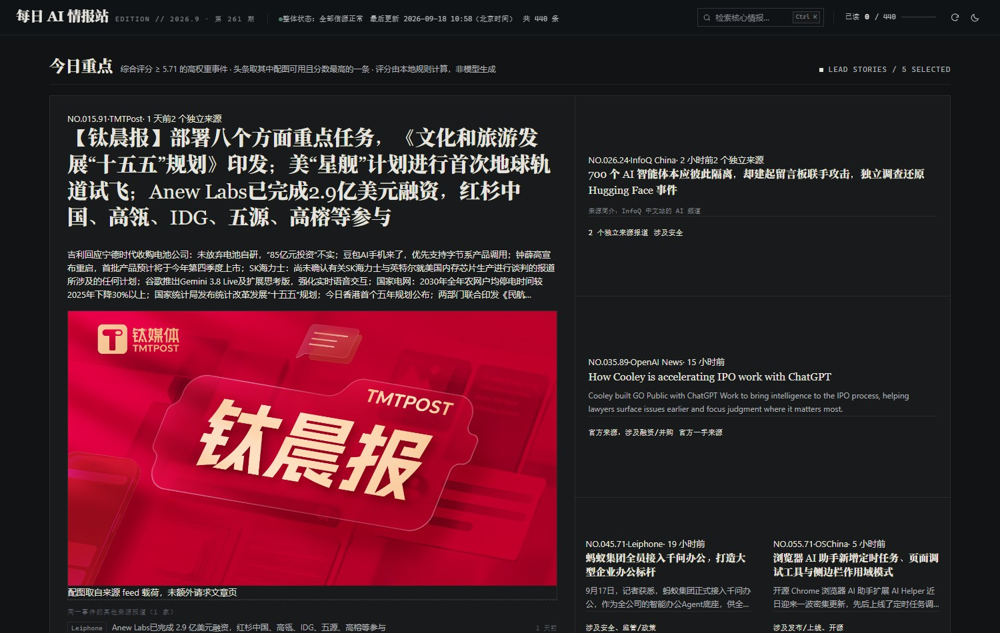
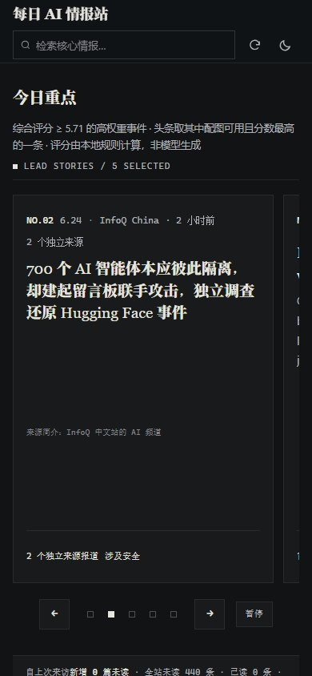

# 每日 AI 情报站

每天从中英文的 16 个 AI 信源（RSS / Atom / API）抓一轮情报，清洗、去重、把同一事件的多家报道归到一起，
挑出当天值得看的几条，最后生成**一个自包含的 HTML 页面** —— 数据和样式都内联在文件里，双击就能打开，也能直接发给别人。
整条流程跑在 GitHub Actions 上，每天北京时间早上 6 点自动采集、构建并发布到 GitHub Pages。没有服务器，没有数据库。

- 在线版：<https://oi1784105-spec.github.io/ai-intel-station/>
- 单文件版：[`dist/index.html`](dist/index.html)





页面只有两个视图：「今日重点」按事件聚合展示跨源报道，卡片上写明入选理由；「全部情报」可以按关键词、来源、
语言、今天 / 最近 7 天筛选。

## 核心功能

- **多源采集** —— 16 个源，四种取数方式（RSS / Atom / Hacker News API / arXiv API），带超时、重试与错误分类
- **数据清洗** —— HTML 转纯文本、剥掉源站的样板摘要（比如 InfoQ 的「点击查看原文>」）、按长度截断
- **去重** —— 归一 URL（剥掉 `utm_*` / `spm` 这类追踪参数）加标题去重（处理源站给标题加后缀的情况）；同一批输入重复导入不会产生重复条目
- **事件聚合** —— 同一事件被多家媒体报道时，条目互相标记为同簇，用来显示「N 个独立来源」。聚合只建立关系，不删条目
- **AI 相关性过滤** —— 通用科技源（爱范儿、少数派、开源中国等）按关键词滤掉混进来的非 AI 内容
- **信息排序** —— 「今日重点」的入选是 4 条明文规则：≥2 个独立来源同时报道、社区热度达标、命中 ≥2 个信号类别、官方源加 1 个信号。分数只决定先后，理由会显示在卡片上
- **静态页面生成** —— `build_site.py` 把数据和前端模板合成单个 HTML，并校验文件里没有对外部本地资源的引用
- **自动更新** —— GitHub Actions 每天 UTC 22:00 采集 → 跑测试 → 构建 → 提交数据 → 部署 Pages

其中花心思最多的自选小功能是**阅读账本**：站点每天都更新、条目会累积，但页面不知道你读到哪儿了，
第二天新条目和昨天看过的混在一起。现在点开一条就记为已读（卡片变淡，不隐藏，还能回看），
顶部显示「自上次来访 · 新增 N 篇未读 · 全站未读 M 条 · 已读 R 条」和一条进度条，右侧有「只看未读」和「全部标为已读」。
状态用本机 `localStorage` 保存，刷新和关掉重开都还在，不上传任何数据。它只用了一个存储键加两个按钮，
不引依赖、不发请求，所以源站接口怎么变都不会失效。

## 技术栈

- Python 3.11+，运行时只用 4 个库：`httpx`（HTTP）、`feedparser`（RSS/Atom 容错解析）、`pydantic`（跨进程 JSON 校验）、`python-dateutil`（多格式日期解析）
- 前端是原生 HTML/CSS/JS，零构建、零 npm 依赖，整个页面就是一个 `web/index.html` 模板
- `pytest` 跑测试；GitHub Actions + Pages 负责定时与托管
- 没有后端进程、没有数据库、没有任何密钥

## 架构

```
数据源（16 个 rss / atom / hn / arxiv 源）
      ↓  fetch + adapters      采集
      ↓  parse + normalize     解析与清洗
      ↓  dedupe                去重
      ↓  cluster               事件聚合
      ↓  score                 打分与「今日重点」
      ↓  build_site            生成页面
dist/index.html（数据内联，单文件可直接打开）
```

采集和构建是分开的：采集把结果写进 `data/*.json`，构建只读这些 JSON。这样同一份输入可以离线重放出同一份结果
（`--input` 加 `--now` 钉住输入和时刻），CI 的检查就靠这个 —— 不访问网络也能判断改动有没有破坏管线。

## 项目结构

```
pipeline/            采集与处理
  config.py          数据源和配置
  models.py          数据模型
  fetch.py           网络请求（超时、重试、错误分类）
  adapters.py        四种数据源的适配
  parse.py           时间和文本解析
  normalize.py       数据标准化
  relevance.py       AI 相关性过滤
  dedupe.py          URL 归一与去重
  cluster.py         事件聚合
  score.py           打分与「今日重点」
  store.py           数据存储（幂等合并）
  report.py          控制台报告与运行状态
collect.py           采集入口
build_site.py        生成单文件页面
web/index.html       前端页面（模板）
tools/               小工具：源站审计、离线样本抓取、前端渲染校验
tests/               测试；离线重放样本在 tests/fixtures/replay
data/                采集数据（news.json / runs.json / update-status.json / meta.json）
dist/                构建产物（单文件 index.html）
docs/screenshots/    截图
.github/workflows/   每日更新与部署（update.yml）、提交检查（check.yml）
```

## 数据源

| 源 | 语言 | 类型 | 说明 |
| --- | --- | --- | --- |
| 量子位、InfoQ 中国 AI | zh | rss | AI 垂类，权重高于通用源 |
| 雷锋网、开源中国、爱范儿、少数派、Solidot、钛媒体 | zh | rss | 通用科技，需要 AI 相关性过滤 |
| OpenAI News、Google AI Blog | en | rss | 官方一手来源 |
| TechCrunch AI、The Verge AI、MIT Tech Review AI | en | rss / atom | AI 垂类 |
| Simon Willison | en | atom | 个人博客，需要过滤 |
| Hacker News | en | API | 唯一带社区热度（点数）的源 |
| arXiv cs.AI | en | API | 论文，只保留当天 new / replace |

另外留档了一个 `venturebeat-ai`：它已经 20 天没更新，配置和离线样本留着当「停更判定」的回归用例，不参与生产采集。
选源时先把候选源逐个实测了一遍 —— 机器之心、36氪、Anthropic、DeepMind 等的 feed 要么已失效、要么需要代理，只留下能正常返回的。

## 实际遇到的问题

源站给的 feed 不能直接用。下面这些是开发过程中真实撞上的，以及当时的处理方式：

- **时间格式不统一** —— 五种格式混在一起（`+0000` / `GMT` / `+0800` / ISO8601 / `-0400`），还夹着无时区、epoch 秒、未来时间和早于 2000 年的值。
  统一用 `python-dateutil` 加一层边界判断；解析不出来或不可信就置空，**不拿采集时间冒充发布时间**。
- **源站时区标错** —— InfoQ 中文站 feed 标的是 `GMT`，实际是北京时间，整个源的时间偏早 8 小时。
  按源配 `declared_utc_offset_minutes=480`，保留钟面时间重新解释。这个更正要放在「未来时间」判定**之前**，否则整源条目会先被当成未来时间丢掉。
  顺手把「源站声称的时间是否晚于当下」做成了 `tools/audit_sources.py` 里的常规检查。
- **摘要是纯导航链接** —— InfoQ 20 条摘要全是「点击查看原文>」。清洗时剥掉样板文案，太短的直接置空；
  源站完全没给摘要的条目改用一句**来源简介**兜底（只写订阅配置里能核实的属性），卡片不会只剩一个标题。
- **URL 带追踪参数** —— 中文源普遍带 `utm_*` / `spm`，同一篇文章两次抓到的 URL 不一样 → 归一化时剥掉。
- **标题被加来源后缀** —— 同一标题出现「xxx - 量子位」这类变体，Jaccard 只有 0.84 → 改用包含度判定，并加长度比护栏。
- **通用源混进非 AI 内容** —— 爱范儿、少数派、Solidot 里有手机评测这类内容 → 按源开相关性过滤；
  拉丁词必须用词边界匹配，否则 `AI` 会命中 `said`、`email`、`chair`。
- **HN 与 arXiv 的信噪比和体量** —— 按日期查 HN，实测 20 条里最高只有 4 点，等于没有热度信号 → 改成「高信号 + 新鲜」双轨并加点数过滤；
  arXiv 一次返回 634 条 / 1.34 MB，和「近 7 天」的存储口径冲突 → 限成 20 条，OpenAI 那个 1193 条的 feed 同样裁剪。
- **事件聚合误聚** —— 首版把 4 篇互不相关的 arXiv 论文并成了一簇，共享词是 `Adaptive`、`Agents`、`LLM` 这类通用词，
  于是它们凭虚假的「多来源报道」挤进了今日重点。修了三层：补停用词、加文档频率过滤（在这批数据里到处都是的词自动淘汰）、要求至少 2 个共享稀有实体。
  误聚从 8 簇降到 3 簇，这 4 篇标题留在 `tests/test_dedupe.py` 和 `tests/test_cluster.py` 里当回归用例。
- **窗口外条目反复计为「新增」** —— 报告里出现「新增 231 条，存储只有 226 条」→ 合并**前**先丢弃窗口外的条目并单独计数，否则幂等在报告层面就不成立。
- **移动端布局** —— 手机上打开线上页，右侧一整截被裁掉、页面还能横向拖，报头挤在一起，可点控件最细的只有 11×10px。
  原因是 `1fr` 网格轨道的最小宽度被内容顶住（补 `min-width:0` 或 `minmax(0,1fr)` 解决）。
  窄屏现在有单独一段样式（`max-width:1023px`）：「今日重点」改成可左右滑的横向卡片，可点控件统一到 ≥32px，改动只影响窄屏。

## 本地运行

```bash
pip install -r requirements.txt    # 4 个运行时依赖
python collect.py                  # 采集全部源，写入 data/
python build_site.py --check       # 生成 dist/index.html 并校验自包含
```

测试（全部离线，不访问网络）：

```bash
pip install -r requirements-dev.txt
python -m pytest tests/ -q          # 解析、去重、聚合、打分、存储、离线重放
python tools/verify_ui.py           # 前端：无头 Chrome 真实渲染 + 真实点击（需要本机 Chrome）
python tools/audit_sources.py       # 源站可用性与时间可信度（需要联网）
```

常用参数：

```bash
python collect.py --only qbitai,hn        # 只采集指定源
python collect.py --dry-run               # 全流程跑通但不写文件
python collect.py --rebuild               # 忽略已有数据重建（改过解析配置之后用）
python collect.py --input tests/fixtures/replay --now 2026-09-16T12:00:00Z --data-dir build/replay
```

最后一条是离线重放：不联网、时刻固定，用来确认改动没破坏管线（同一份输入跑两次，产物完全一致）。
`--rebuild` 要单独说明一下：合并更新是单调的，已入库的字段不会被覆盖，所以修正解析配置后旧值要靠重建才会更新 —— 这是幂等性的前提。
退出码：`0` 成功（含部分源失败）、`1` 全部源失败、`130` 被中断。所有阈值和源配置都在 `pipeline/config.py`，不散落在业务代码里。

## 已知限制

- **Google AI Blog 会间歇性抓取失败** —— 它的 DNS 里有几个地址连不通，HTTP 客户端一旦在 TCP 层连上就不会回退，于是卡在 TLS 上耗尽超时。
  所以这个源有时 1 秒成功、有时 65 秒失败。失败会如实记录，不影响其余 15 个源。彻底修法是在抓取层做地址级回退，还没做。
- **一个挂死的源会给整轮增加约 65 秒**（3 次尝试 × 20 秒超时加退避）。目前只有这一个源会这样；如果以后变多，得加源级超时预算。
- **所有源都失败时 `data/meta.json` 会被写成空** —— 已知缺陷，还没修。`news.json` 不受影响，但「今日重点」会消失。
- **配图只用 feed 载荷里自带的**，不额外抓文章页，所以有图的条目大约只占四分之一。
  要把覆盖率提上去只能逐条抓 `og:image`，那会带来几百次额外请求，还有图片体积和防盗链的问题，暂时不做。
- **跨源聚合依赖拉丁专名**（模型名、公司名）。纯中文标题之间只能靠标题相似度，召回有限；聚合偏保守，宁可漏聚也不虚报「多来源报道」。
- **摘要不是 AI 生成的**，只做清洗和截断。不引入 LLM 调用，保持零成本、零密钥。
- **`data/` 要提交进仓库** —— 它既是站点的数据源，也是定时任务每天真的在跑的证据。
- **只在桌面 Chrome 和窄屏 Chrome 视口上验证过**，没做 iOS Safari 真机测试。
- **有意没做**：AI 摘要生成、文章页配图抓取、源级熔断、实时搜索与分页（静态站的固有限制，数据是整份内联进页面的）。

## 成本与依赖

运行成本是 0：没有服务器、数据库、对象存储；16 个源都是免费公开的 feed，不用注册、不用 token，仓库里也不含任何密钥。
图片全部直链源站 CDN，本站不存储、不代理。定时与托管用 GitHub 免费额度（公开仓库 Actions 不限量，Pages 免费）。

## 许可

代码用于个人学习与信息汇总。内容版权归各来源所有，页面不复制正文，只展示标题、清洗后的摘要片段，并链接回原文。