# 每日 AI 情报站

每天自动汇总中文与英文来源的 AI 情报，做跨源事件聚合与可解释的重点推荐，产出**单个自包含 HTML**。

- **在线版**：<https://oi1784105-spec.github.io/ai-intel-station/>（每日北京时间 06:00 自动更新）
- **离线版**：`dist/index.html` —— 单个文件、数据已内联，**双击即可打开**，也可以直接发给他人

## 交付材料索引

| 材料 | 文件 | 内容 |
| --- | --- | --- |
| 源码 | 本仓库 | 采集管线、前端、测试、离线样本、CI 配置 |
| 说明文档 | [`README.md`](README.md) | 本地运行、部署、技术选型理由、数据来源、更新方式、已知限制、**成本与外部依赖** |
| 开发说明 | [`DEVLOG.md`](DEVLOG.md) | 实际投入时间（**约 6h**）、主要开发工具与 AI 使用情况、**两个关键决策**、**问题发现与解决过程（主线）** |
| 验证记录 | [`VERIFICATION.md`](VERIFICATION.md) | 真实数据获取、固定输入重复导入、单个来源失败的验证结果；明确列出**已验证 / 未验证 / 未完成** |
| 技术设计 | [`docs/PLAN.md`](docs/PLAN.md) | Phase 0 技术设计与实施计划（含对基线文档的补强） |
| 单文件成品 | [`dist/index.html`](dist/index.html) | 数据已内联，双击即可打开，也可直接转发 |
| 提交消息 | [`SUBMISSION.md`](SUBMISSION.md) | 按测试题 §07 格式填写 |

## 成品怎么看

| 想看什么 | 怎么做 |
| --- | --- |
| 页面成品 | 双击 `dist/index.html`（无需服务器、无需联网） |
| 一次真实采集过程 | `python collect.py` |
| 不访问网络也能复现同一份结果 | `python collect.py --input tests/fixtures/replay --now 2026-09-16T12:00:00Z --data-dir /tmp/x` |
| 每个信息源当前可用性 | `python tools/audit_sources.py` |
| 管线是否被改坏 | `python -m pytest tests/ -q` |
| 前端是否被改坏（真实渲染 + 真实点击） | `python tools/verify_ui.py` |

## 在线版本沿革（初版 → 第二版 → 第三版 → 第四版 → 第五版 → 第六版）

线上演示地址跑的是**第六版**。六版都留了截图，便于对照。

**初版**（9-16 首次上线的最初版本）：

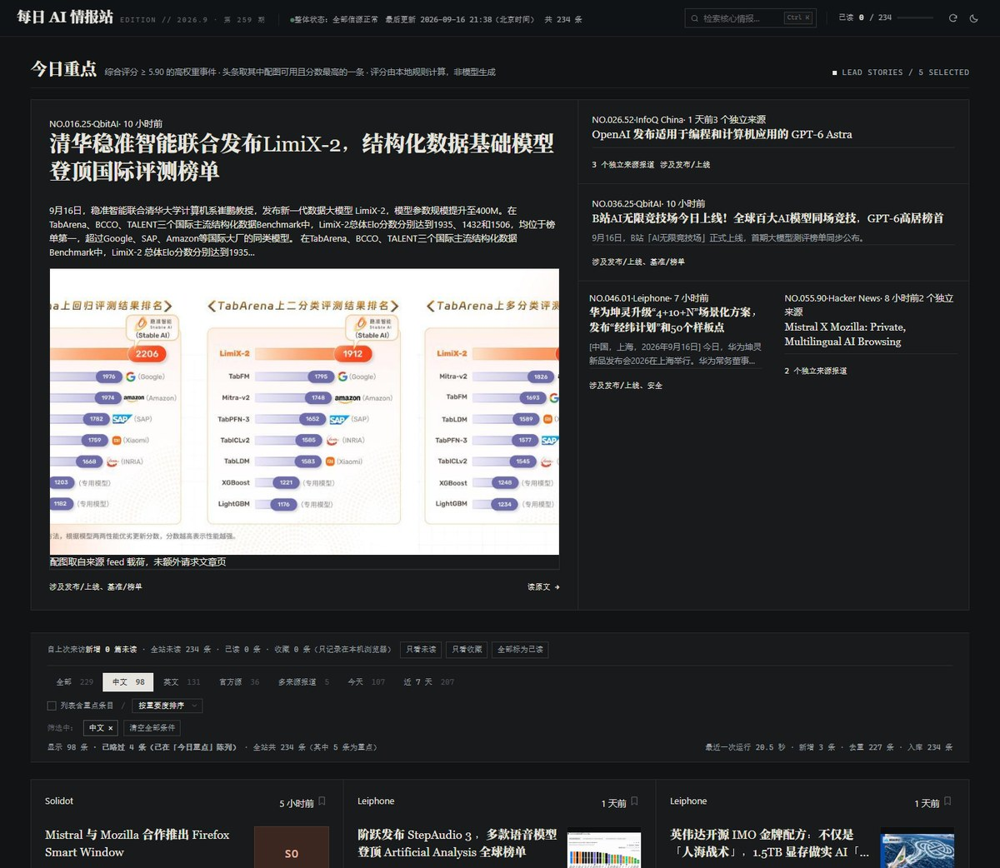

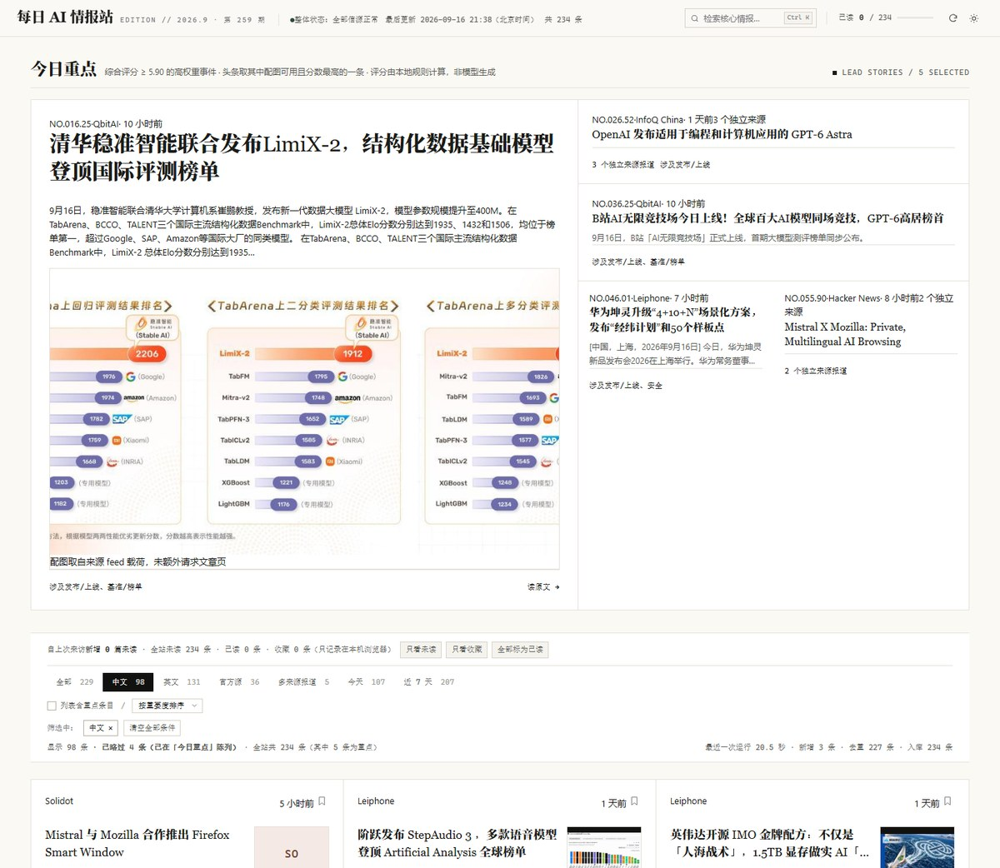

**第二版**（桌面版式；截图取自 `dist/index.html` 构建产物）：

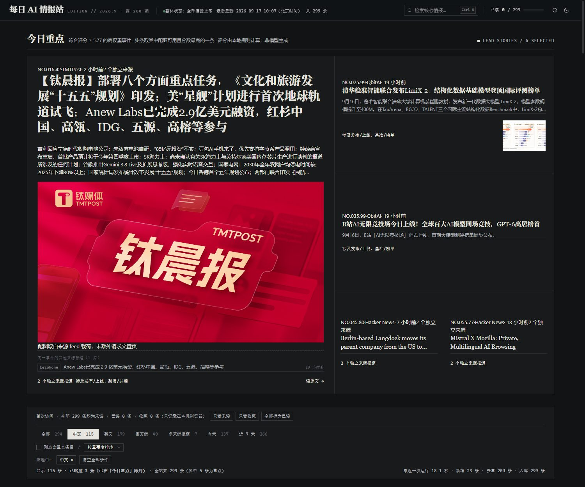

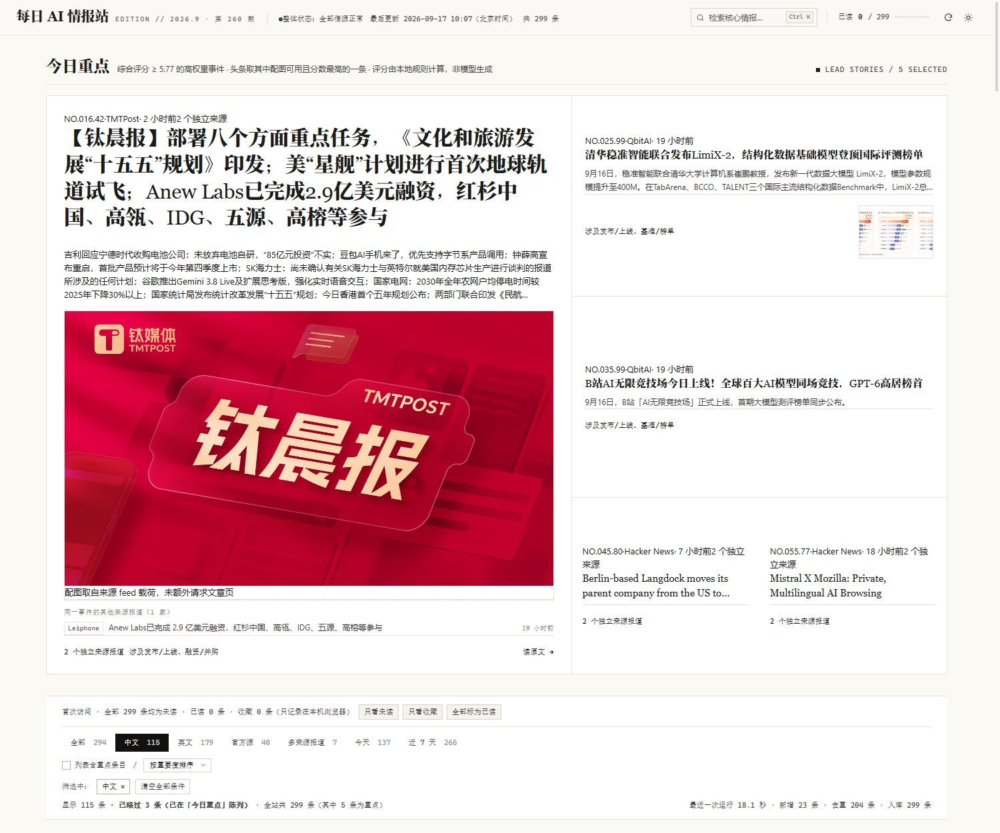

**第三版**（手机端版式，截图在 **390px 视口**下渲染）：

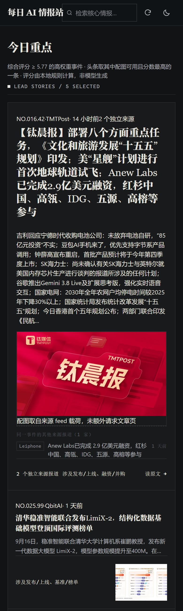

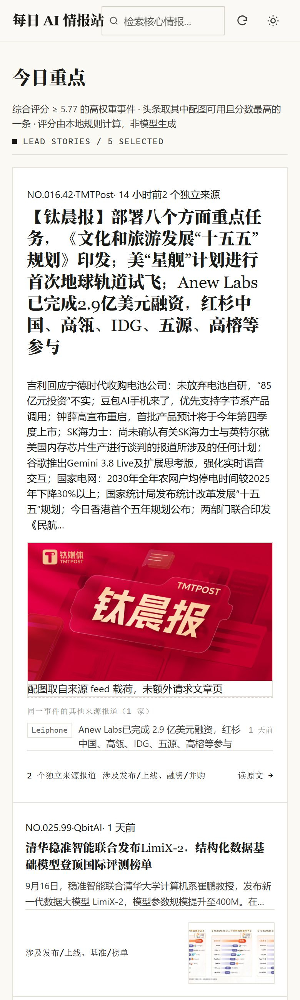

> 第三版**只改窄屏**，桌面渲染与第二版逐字节相同（6 张桌面截图 SHA-256 比对一致，见
> `VERIFICATION.md` 1.6.1），所以上面那两张桌面截图仍然代表当前线上效果。

**第二版改了什么**（发现了什么问题 → 怎么解决）：

| 问题 | 解决 | 实测 |
| --- | --- | --- |
| 「今日重点」右栏底部攒出一整块纯背景空白 | 侧栏不再按内容自然高度，而是**按特稿高度等分**、条目内容垂直居中 | 底部空洞 **241px → 0px**，侧栏与特稿 **867 = 867px** |
| 未读正文颜色太淡，读起来费劲 | 把「淡」从通用正文移到**已读态**：未读用提对比度令牌，已读才降不透明度 | 未读正文对比度 深色 **8.23:1** / 浅色 **10.33:1**（浅色原 6.77:1）；已读态 `opacity .55` |
| 一个信源反复抓取失败，原因不明 | 逐层拆 DNS / TCP / TLS，定位到 `blog.google` 的可用地址里有一半不可用（详见「已知限制」第 1 条） | 截至本次提交的 24 轮里该源 8 轮成功（秒级）/ 7 轮失败（每次约 65 秒）/ 9 轮无新条目，7 次失败**全部**来自它；失败被如实上报，不影响其余 15 个源 |
| 「重要度评分」后面用顿号，读起来像并列 | 改为冒号（它后面跟的是「用什么算的」） | 套件里新增一条断言把整句字面钉住，改动不会静默回退 |

左（改前 · 线上原来的版式）与右（第三版）同一个 390px 视口下渲染 —— 被裁掉的那一截、挤成一团的报头，
可以直接对照出来：

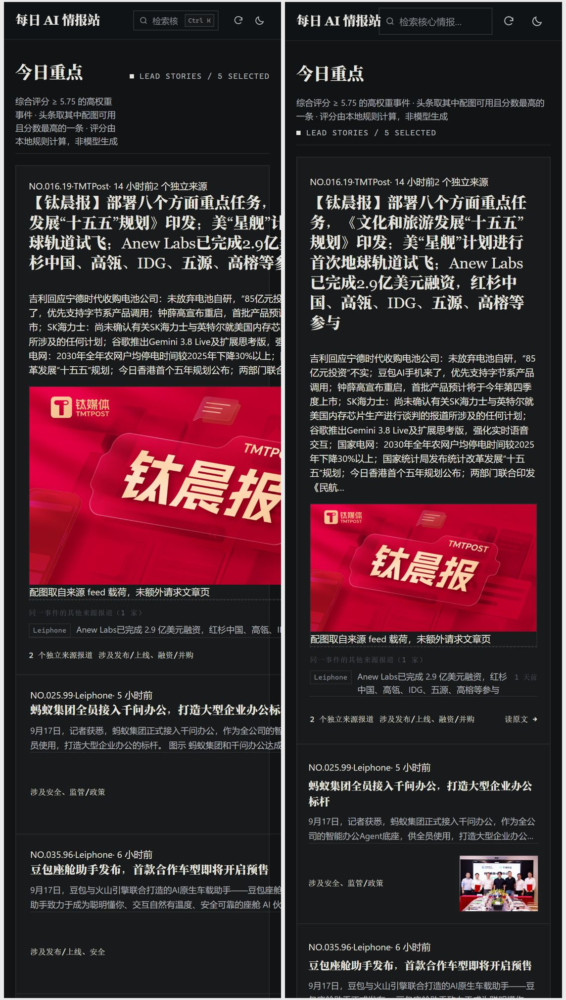

**第三版改了什么**（手机上打开线上页，右侧一整截被裁、能横向拖）：

| 问题 | 解决 | 实测（390px 视口） |
| --- | --- | --- |
| 整页横向溢出、右侧内容被裁 | 「今日重点」是单栏 `1fr` 网格，而同题报道那条 `nowrap` 标题把轨道的最小宽度顶到 531px；给网格项补 `min-width:0` | 文档宽 **549px → 390px**；越界元素 **37 → 0** |
| 展开「数据面板」时源表把整页顶宽 | 源表是 `table-layout:auto`，让它在面板内部自己横向滚动 | 展开态文档宽 **422px → 390px** |
| 手机上可点控件太小（最细的是「语言」筛选 11×10px） | 窄屏统一给到 ≥32px、图标按钮 38px（规则放 `max-width:1023px`，平板同样受益） | 不达标控件 **386 → 0** |
| 报头挤：桌面快捷键提示 Ctrl K 占着位置，占位文字只显示到「检索核…」 | 窄屏隐藏该提示、搜索框吃掉剩余宽度 | 占位文字需 88px / 可放 **50px → 120px**；报头高 **55px** |
| 「今日重点」的说明文字被右侧英文小标签挤成 145px 窄条 | 窄屏改为竖排，说明文字占满整行 | 说明文字宽 **145px → 358px** |

改动只落在 `web/index.html` 的 `max-width:1023px` / `640px` 两段、其构建产物 `dist/index.html`，
以及校验脚本 `tools/verify_ui.py`（新增 390px 手机段 10 条断言）；采集管线未改。

**第四版**（手机端报头与字号；下面的对照图取自同一 393px 视口，左 = 第三版，右 = 第四版）：

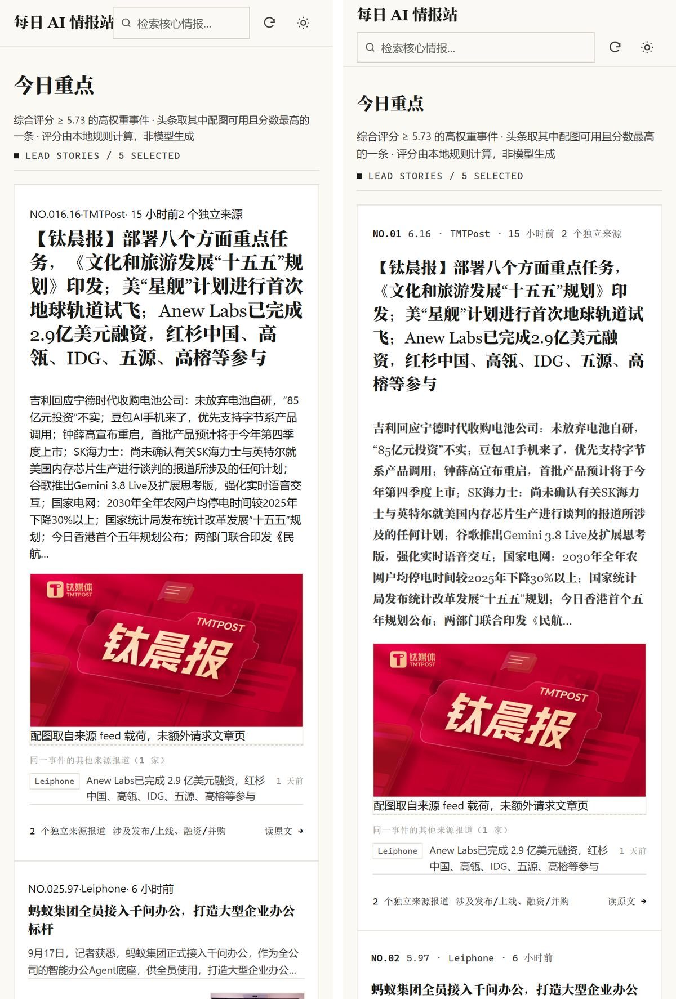

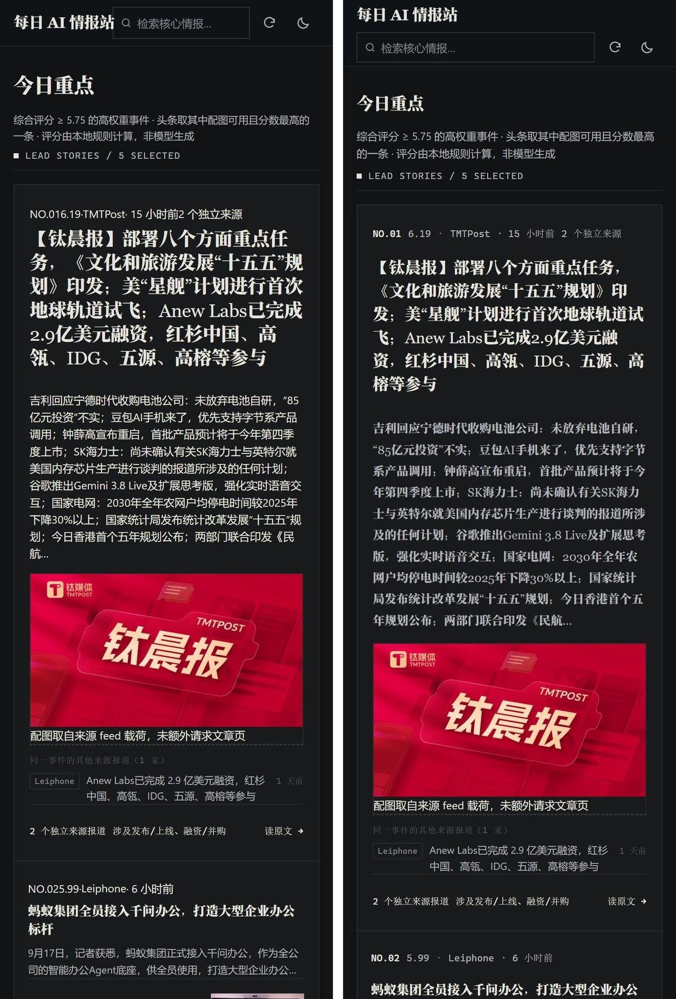

**第四版改了什么**（真机 393px 打开线上页：站名压住搜索框、头条字大得像一堵墙）：

| 问题 | 解决 | 实测（393px 视口） |
| --- | --- | --- |
| **站名与搜索框重叠**。真机截图肉眼可见，但「有没有元素越出屏幕」这类检查**查不出来** | 窄屏报头改两行：站名一行，搜索框整行 + 图标。根因是 `.mast-left{min-width:0}` 允许左栏被压扁、而站名 `flex-shrink:0` 拒绝收缩，文字溢出自己的盒子**照样绘制**，于是画在输入框上 | 站名右缘 **135.2px** vs 搜索框左缘 **123.1px**（压 12.1px）→ 分两行后矩形**不相交**、垂直间隔 11px；输入框宽 **138.9 → 244px**；报头高 55 → **79px**（仍 ≤80px 不抢屏）；行数 **2** |
| 头条字太大、行距太紧，像一堵墙；「今日重点」24px 比站名 18px 还大（层级倒挂） | 窄屏另立一套字号：头条 27 → **19px / 行高 1.45**，区块标题 24 → 20px，卡片正文 12 → 13px / 1.75 | 头条 **19px / 行高比 1.45**；区块标题 20px vs 站名 18px |
| 头条正文与元信息行的排版规则**从未生效** | CSS 写的选择器是 `.lead-hero .sum` / `.lead-no`，而 JS 渲染出的真实类名是 `lead-sum` / `lead-meta` —— 两处都按真实类名重写：正文 14px / 1.8 衬线，元信息改等宽小字、可换行分隔排布 | 头条正文 **继承 13px 无衬线 → 14px 衬线**；元信息 11.5px 等宽 |
| 把卡片正文提到 13px 后，**360px** 视口整页又溢出 9px | 卡片网格是 `1fr` 单列，轨道自动最小值取内容 min-content（`-webkit-line-clamp` 的收缩盒算出来 352px）；改 `minmax(0,1fr)`，并把同类的 `1fr` 网格一并钉死 | 360px 文档宽 **369 → 360px**；越界元素 1 → 0 |

同样只动 `web/index.html` 的窄屏两段；校验脚本的手机段从 1 档扩到 **2 档（360px / 390px）**、
断言 10 → 15 条，总数 **99 → 119**（119 / 119 通过）。桌面 1024 / 1280 / 1500 × 深浅共 6 张截图
与第三版**逐字节相同** —— 比对时深浅两档都**显式种主题**：无头 Chrome 的 `prefers-color-scheme`
默认是深色，若按「浅色不注入」来跑，两档会渲染成同一个主题、哈希当然相同，等于漏验一组。

**第五版**（窄屏「今日重点」由竖排堆叠改成横向 Banner 轮播；下面的对照图取自同一 393px 视口，左 = 第四版，右 = 第五版）：

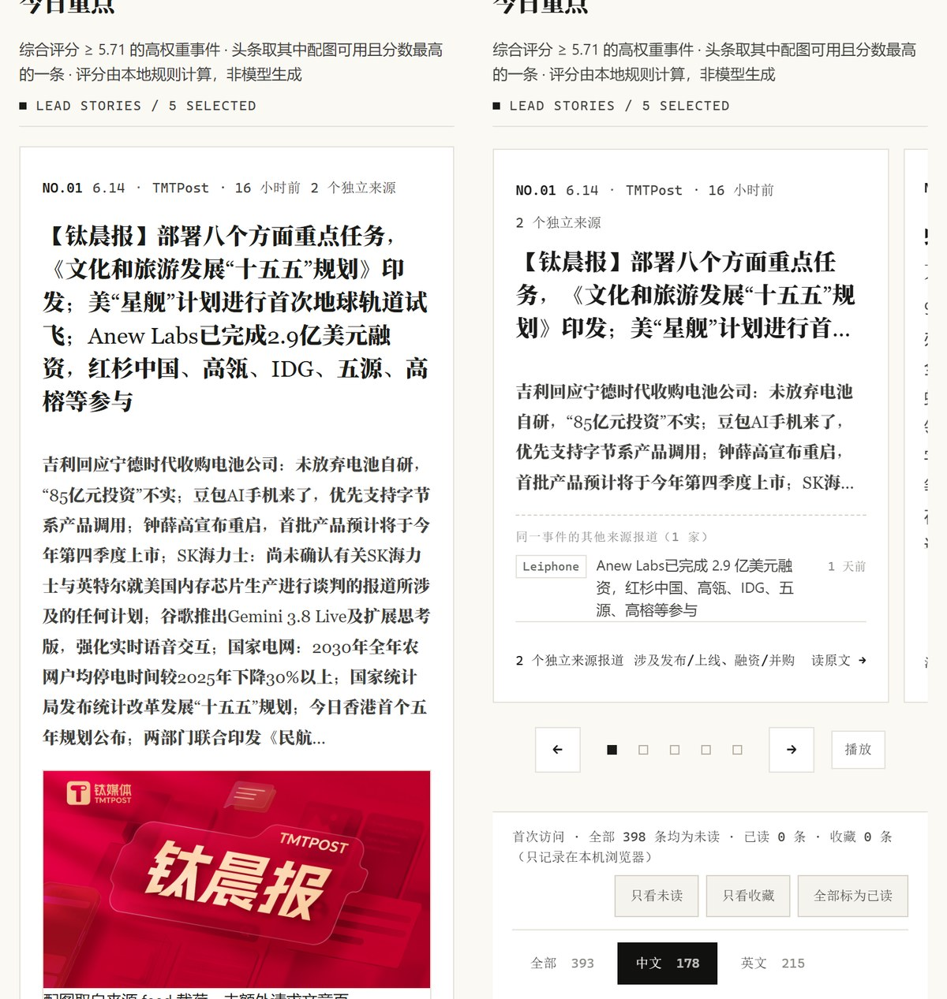

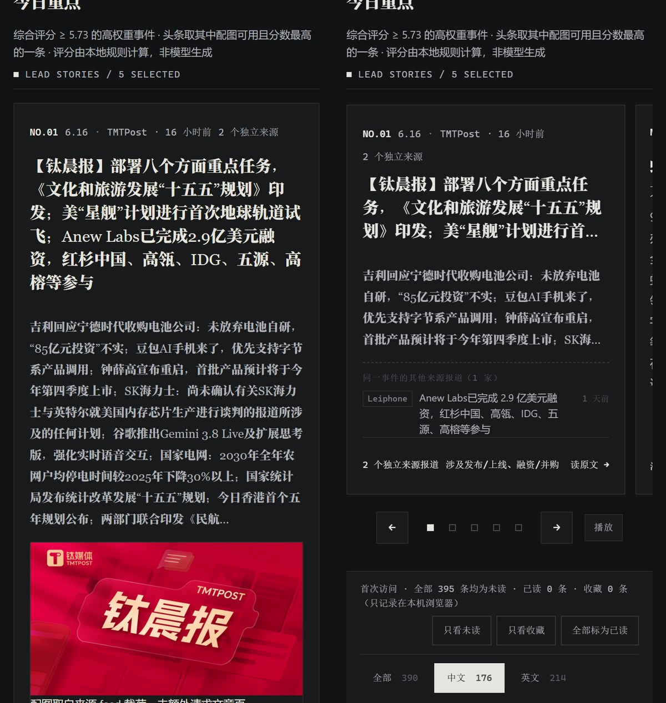

**第五版改了什么**（手机上「今日重点」原是一摞竖排卡片，不往下翻不知道有几条）：

| 目标 | 做法 | 实测（393px 视口） |
| --- | --- | --- |
| 一次主要看一条、可左右滑动 | 窄屏把 `.lead-grid` 变成横向吸附轨道（**原生滚动** + `scroll-snap-type:x mandatory`），每张重点卡自己是一屏；`.lead-side` / `.lead-mini` 两个纯包装盒用 `display:contents` 拆掉 —— DOM 结构一个节点都不动 | 轨道 361px / 屏宽 329px / 屏数 = 重点条目数 = **5** |
| 静止时看得出左右还有内容 | 屏宽 = 轨道宽 − 32px，让下一屏露出 20px 的边；轨道尾部补上同样的内距，最后一屏才吸得齐左缘 | 露出 **20px**；自动播放后当前屏左缘离轨道左缘 **0px**（吸附对齐，不卡在两屏之间） |
| 平滑左右滑动，不是突然闪切 | 不自己写动画：滚动目标 + `scroll-behavior:smooth`，滑动交给浏览器原生实现；`prefers-reduced-motion` 下改走一跳到位 | 正常档 `smooth` / 减弱动效档单跳（两条轨迹对照） |
| 分页指示器 + 左右箭头 + 自动轮播 | 底部控制条 ←、每屏一颗方点、→、暂停/播放，**全是真按钮**（点哪一屏就滚到哪一屏，首尾相接）；手动操作后 8 秒才恢复自动播放，手指按住 / 悬停 / 键盘聚焦期间停表 | 5 颗指示点全部可点（≥32px 且命中自己）；「下一条」0 → 1；首屏往回 → 第 5 屏；点第 3 颗 → 第 3 屏；「暂停」真停、「播放」真走 |
| 每屏等高，但不能空出半张白卡 | 屏高由最高那屏决定，于是让矮的屏**自己吃掉余量**：摘要 `flex:1 1 auto`（末尾仍是省略号）、带缩略图的屏让缩略图竖着撑满、标签行 `margin-top:auto` 钉底 | 各屏内容占框高 **90 / 96 / 96 / 96 / 96 %**（改前纯文字那屏只有 **48%**，视觉上像破图） |
| 头条那屏本来最高（带 16:9 大图） | 窄屏收起头条的大图（桌面照旧显示大图；这条情报在下方「全部情报」卡片里仍带自己的配图），标题 3 行、正文 4 行，省略号收 | 整条高度 **512px**（390px 视口，随数据浮动）；没有一屏的内容被硬切 |

只动 `web/index.html` 的窄屏两段。`tools/verify_ui.py` 手机段新增 **20 条**、电脑段新增 **2 条**
（「电脑端仍是 12 栏网格」「电脑端不显示控制条」），总数 **119 → 161**；第六版再补 5 条 → **166**（166 / 166 通过）。
桌面 1024 / 1280 / 1500 × 深浅共 6 张截图与第四版**逐字节相同** —— 两页共用同一个「现在」并禁掉过渡：
相对时间按每条情报自己的时间戳在任意分钟边界翻档，不钉时钟会随机差一个 9×9px 的单字符；
不禁过渡则某个淡入在两次截图里差一点点，整块背景差 1 个灰阶，看着像「不同」其实不是改动留下的痕迹。

**第六版**（按测试题 §03 / §05 / §06 逐条自检后对齐的三处，**版式无变化**，因此没有对照截图）：

| 自检发现 | 做法 |
| --- | --- |
| 432 条里 **93 条**源站 feed 没给摘要，卡片只剩标题 —— 不满足 §03-02「标题 + 简短摘要**或来源简介** + 来源 + 时间 + 原文链接」 | 按来源 id 加一句**来源简介**兜底（只写订阅配置里能核实的属性：语言 / 类型 / 是否官方 / 是否做相关性过滤），一律以 `来源简介：` 开头，和 `摘要：来源 feed 原文` 显式区分 —— 它是「这个源是什么」的说明，不是对文章内容的概括，**不补造事实** |
| 发布时间缺失时写的是「时间未知」，条款原文是「发布时间**未知**」 | 文案改为「**发布时间未知**」，注释里写明绝不拿 `first_seen_at`（采集时间）冒充发布时间 |
| 零密钥是本项目的设计，但 `.gitignore` 没挡 `.env` | 补 `.env` / `.env.*` / `*.env` / `secrets.json` 四条防线 |
| 换一批数据后，窄屏轮播**第 2 屏只填 46% 高度**（该条重点既没配图、源站也没给摘要，一屏只剩标题 + 一行来源简介）→ v5 那条「每屏内容占框高 ≥75%」的断言当场报红 | 窄屏给「无配图的重点条目」补一个**源色占位块**（来源首字母 + 一行小字「本条来源未提供配图」，和列表卡 `.thumb.ph` 同一套语言），让它自己吃掉余量 —— 各屏回到 **89 / 95 / 96 / 96 / 96 %**。该元素在桌面端 `display:none`，电脑端布局不受影响 |

自检逐条结论（含缺少日期 / 长标题 / 无图 / 搜索无结果 / 干净环境跑通 / 抽查原文）见
[`VERIFICATION.md` §1.10](VERIFICATION.md)。

> 口径提醒：第六版**电脑端也会变**（432 条里 93 条、默认视图里 52 张卡片会多一行「来源简介」小字），
> 所以「桌面截图逐字节不变」只适用于**第四版 / 第五版**那两次改造的取证，不代表第六版。
> 第六版改的是**内容兜底与文案**（+ 一个只在窄屏显示的占位块，桌面端 `display:none`）：
> 电脑端不新增可见元素类型，多出来的只是一行既有样式的小字。

## 快速开始

要求 Python 3.11+，无系统级依赖。

```bash
pip install -r requirements.txt          # 4 个运行时依赖
python collect.py                        # 采集全部源，写入 data/
python build_site.py --check             # 构建 dist/index.html 并校验自包含
```

验证（干净环境验收用）：

```bash
pip install -r requirements-dev.txt
python -m pytest tests/ -q               # 205 项：单元 + 验收
python tools/audit_sources.py            # 源站审计，需要联网
python tools/verify_ui.py                # 前端渲染与交互，需要已构建的 dist/ 与本机 Chrome
```

**运行时依赖只有 4 个**：`httpx`（HTTP）、`feedparser`（RSS/Atom 容错解析）、
`pydantic`（跨进程 JSON 边界校验）、`python-dateutil`（多格式日期解析）。
`pytest` 仅在 `requirements-dev.txt` 中。前端零构建、零依赖。

## 目录结构

```
pipeline/            采集管线（每个模块一个明确职责）
  config.py          源注册表 + 全部可调参数（阈值不散落在业务代码里）
  models.py          数据模型；跨进程 JSON 都经此校验
  fetch.py           网络层：UA/超时/重试退避/错误分类 + 离线重放实现
  adapters.py        四类源适配器：rss / atom / hn / arxiv
  parse.py           时间解析与文本归一化
  normalize.py       RawItem → Article
  relevance.py       通用科技源的 AI 相关性过滤
  dedupe.py          URL 归一、标题去重、实体抽取
  cluster.py         事件聚合（跨源报道归簇）
  score.py           可解释打分 + 「今日重点」入选规则
  store.py           原子写、幂等合并、滚动窗口
  report.py          控制台报告与 update-status.json
collect.py           采集入口（CLI）
build_site.py        单文件站点构建 + 自包含校验
web/index.html       前端（原生 HTML/CSS/JS，零构建）
tools/
  audit_sources.py   源站审计：可达性、字段质量、时间可信度
  capture_fixtures.py 抓取离线重放样本 + 生成来源清单（含 sha256）
  verify_ui.py       无头 Chrome 真实渲染 + 真实点击校验（166 项断言，含 360px / 390px 手机段）
data/                产物：news.json / runs.json / update-status.json / meta.json
dist/                单文件站点产物
tests/               单元测试、验收测试、离线样本
```

## 架构与数据流

```
                 ┌──────────── GitHub Actions（每日 UTC 22:00 = 北京 06:00）────────────┐
                 ▼                                                                      │
  16 个源 ──▶ fetch ──▶ adapters ──▶ normalize ──▶ relevance ──▶ store.merge ──▶ cluster ──▶ score
  (rss/atom          (超时/重试/     (RawItem →    (AI 相关性     (幂等合并 +      (跨源事件   (可解释
   /hn/arxiv)         错误分类)       Article)      过滤)          窗口裁剪)        归簇)      打分)
                 │                                                                      │
                 ──────────────────── data/*.json ───────────────────────────────────┘
                                          │
                             build_site.py ──▶ dist/index.html（数据内联，单文件）
```

设计约束：**静态站 + 云端定时任务**。不依赖任何个人电脑开机，零服务器、零运行时成本。

## 数据源

实测时点 2026-09-16，全部返回 HTTP 200。源清单、条目数与日期格式均为实测结果，
不是从文档抄来的。

### 生产源（16 个）

| id | 名称 | 语言 | 类型 | 权重 | 实测条目 | 日期格式 | 备注 |
| --- | --- | --- | --- | --- | --- | --- | --- |
| `qbitai` | 量子位 | zh | rss | 1.10 | 10 | `+0000` | AI 垂类 |
| `infoq-ai` | InfoQ 中国 AI | zh | rss | 1.05 | 20 | `GMT` | **时区标注错误，已更正** |
| `leiphone` | 雷锋网 | zh | rss | 1.00 | 20 | `+0800` | 通用科技，需过滤 |
| `oschina` | 开源中国 | zh | rss | 0.90 | 50 | `+0800` | 通用科技，需过滤 |
| `ifanr` | 爱范儿 | zh | rss | 0.90 | 20 | `+0000` | 通用科技，需过滤 |
| `sspai` | 少数派 | zh | rss | 0.85 | 10 | `+0800` | 通用科技，需过滤 |
| `solidot` | Solidot | zh | rss | 0.90 | 20 | `+0800` | 通用科技，需过滤 |
| `tmtpost` | 钛媒体 | zh | rss | 0.85 | 19 | `+0800` | 通用科技，需过滤 |
| `openai` | OpenAI News | en | rss | 1.30 | **1193** | `GMT` | 官方源，须裁剪 |
| `google-ai` | Google AI Blog | en | rss | 1.25 | 20 | `+0000` | 官方源，大陆需代理 |
| `techcrunch-ai` | TechCrunch AI | en | rss | 1.10 | 20 | `+0000` | AI 垂类 |
| `verge-ai` | The Verge AI | en | atom | 1.05 | 10 | `-04:00` | AI 垂类 |
| `mit-techreview-ai` | MIT Tech Review AI | en | rss | 1.10 | 10 | `+0000` | AI 垂类 |
| `simonw` | Simon Willison | en | atom | 1.00 | 30 | `+00:00` | 需过滤 |
| `hn` | Hacker News | en | hn | 1.20 | 21 | ISO8601 | 唯一有热度信号的源 |
| `arxiv` | arXiv cs.AI | en | arxiv | 0.95 | **634** | `-0400` | 须限流 |

### 留档源（1 个，不参与生产采集）

| id | 名称 | 为什么留着 |
| --- | --- | --- |
| `venturebeat-ai` | VentureBeat AI | 实测 30 条上限内最新一条停在 **2026-08-27**，已 20 天无更新。它是「疑似停更」判定的真实样本，保留配置与离线样本用于回归，而不是删掉配置让这条排查经验消失 |

### 已排除的源与理由

选源时先实测，不信任源站自称的 feed 类型。

| 源 | 实测结果 | 结论 |
| --- | --- | --- |
| 机器之心 `/rss` | 返回「数据服务」HTML 页，不是 feed | 排除（feed 已废弃） |
| 36氪 `/feed` | 返回 JS 反爬页 | 排除 |
| 品玩 | XML 非法：`not well-formed: line 56` | 排除（但保留了 feedparser 的容错能力） |
| Anthropic | 404，无官方 feed | 排除 |
| DeepMind | TLS 握手超时 | 排除 |
| DeepLearning.AI | 404，无官方 feed | 排除 |
| HuggingFace / Reddit | 需要代理 | 不引入（避免把代理变成运行前提） |

## 实测发现的数据缺陷与处理

这部分是本项目的核心工作量：**源站给的数据是不能直接用的**。

| # | 缺陷 | 实测证据 | 处理 |
| --- | --- | --- | --- |
| 1 | **源站时区标注错误** | InfoQ 中文站 feed 标注 `GMT`，但最新一条 pubDate 恰好等于抓取时刻的**北京时间**（实测 `19:25:24 GMT` vs 真实 `11:25:24 UTC`），整源时间偏早 8 小时 | 源级配置 `declared_utc_offset_minutes=480`，保留钟面时间按北京时间重新解释；更正在「未来时间」判定**之前**执行，否则整源条目会先被当未来时间丢掉 |
| 2 | **摘要是纯导航链接** | InfoQ **20/20** 条摘要都是 `点击查看原文>`（平均 7 字符）；全部源合计 279 条中 35 条（12.5%）摘要为空或极短 | `clean_summary()`：转纯文本 → 剥样板文案 → 低于 `SUMMARY_MIN_CHARS` 即置空。前端宁可不渲染摘要，也不渲染一句「点击查看原文>」；**源站没给摘要的条目退到「来源简介」**（见第六版），卡片不会只剩一个标题 |
| 3 | **窗口外条目反复"新增"** | 报告出现「新增 231 条但存储仅 226 条」 | `split_by_window()` 在合并**前**丢弃窗口外条目，并单独计数。否则每轮都把同一批过期条目当新增再淘汰一次，幂等性在报告层面不成立 |
| 4 | **HN 按日期查询信噪比为零** | `search_by_date?query=AI` 实测 20/20 条 `points<10`（最高 4 分），首条与 AI 无关 | 改用**双轨**并加数值过滤：高信号轨 `points>80` + 新鲜轨（6 小时内 `points>20`），合并去重 |
| 5 | **arXiv 体量与「近 7 天」在数学上冲突** | 单次响应 **1.34 MB / 634 条**，RSS 无 `max_results` 参数；634 条/天 vs 1000 条存储上限 = 1.5 天，而「近 7 天」需约 4500 条 | `max_items=20` 限流，并按 `announce_type` 只保留 `new`/`replace` |
| 6 | **OpenAI 单 feed 1193 条 / 725 KB** | 首次导入会一天灌满存储 | `max_items=20` 按发布时间倒序裁剪 |
| 7 | **日期格式四种 + 时区缺失** | `+0000` / `GMT` / `+0800` / ISO8601 `+00:00` / `-0400` | `python-dateutil` + 自建边界处理：未来时间、epoch 秒/毫秒、无时区、早于 2000 年，全部显式分类 |
| 8 | **URL 被追踪参数污染** | 中文源普遍带 `utm_*` / `spm`，同一篇文章二次抓取 URL 不同 | URL 归一化剥离追踪参数，这正是「重复导入不应产生重复记录」的真实陷阱 |
| 9 | **标题被源站加来源后缀** | 同一标题出现 `xxx - 量子位` 变体 | 重复判定用**包含度**而非 Jaccard（此时包含度 1.0，Jaccard 仅 0.84） |
| 10 | **通用源混入非 AI 内容** | 爱范儿/少数派/Solidot 含手机评测、消费电子新闻 | 按源开启 AI 相关性过滤；拉丁词必须用**词边界**匹配（子串匹配会让 `AI` 命中 `said`/`email`/`chair`） |

### 一次真实的事件聚合缺陷（已修复并保留回归用例）

首版聚合把 **4 篇互不相关的 arXiv 论文并成了一簇**，共享实体是 `Adaptive` / `An` / `Agents` / `LLM`
这类通用词；并查集的传递闭包又把它们链成一组。后果是这些论文凭**虚假的「多来源报道」**
挤进了「今日重点」。修复分三层：

1. 停用词表补齐冠词（`A` / `An` / `The` —— 标题里必然出现，最容易被凑数）与通用技术名词（`Agent` / `Model` / `LLM` / `Adaptive` …）；
2. **文档频率过滤**：在本次比较窗口内出现次数超过 `CLUSTER_DISTINCTIVE_ENTITY_MAX_DF` 的实体不参与聚合 —— 这是对静态黑名单的动态补充，黑名单漏掉的词只要在这批数据里到处都是就会被自动淘汰；
3. 判定要求 **≥2 个共享稀有实体**，且同源报道不构成「跨源事件」。

修复后误聚从 8 簇降到 3 簇，且全部是真实跨源事件。这 4 篇标题作为回归用例保留在
`tests/test_dedupe.py` 与 `tests/test_cluster.py`（来源交替分配，以隔离出真正被测的那一层）。

## 核心算法

### 四段去重

| 段 | 判据 | 解决什么 |
| --- | --- | --- |
| 1 | `id` 相同（由归一 URL 派生） | 同一 URL 重复导入 |
| 2 | 归一 URL 相同 | 追踪参数 / 大小写 / 尾斜杠 / fragment 差异 |
| 3 | 标题归一后完全相同 | 同一文章被源站改写链接 |
| 4 | 标题 3-gram **包含度** ≥ `DUP_TITLE_CONTAINMENT`，且有长度比护栏 | 标题被加上来源后缀 |

第 4 段用包含度而非 Jaccard：实测的重复形态是「同一标题加后缀」，此时包含度 1.0 而 Jaccard 仅 0.84。

### 去重与聚合的区别

**去重是删除，聚合是建立关系。** 同一事件被 5 家媒体报道，5 条都必须保留（这是「多个来源」的广告位），
只是互相标记为同簇。聚合先按时间窗（72 小时）与倒排索引（4-gram + 实体词分桶）生成候选对，
只对候选对求相似度，把 O(n²) 从约 2400 条压到约 240 条。

### 「今日重点」：入选是规则，排序才是分数

只用一条分数阈值做入选，最后无法解释「为什么这条是重点」。这里把入选条件写成 4 条可原文复述的规则：

1. ≥2 个独立来源同时报道
2. 社区热度 ≥ `HIGHLIGHT_MIN_HEAT`（HN 分数）
3. 命中 ≥2 个信号类别（发布/上线、开源、融资/并购、安全、基准/榜单、监管/政策）
4. 官方源 + 命中 ≥1 个信号

`score` 只负责把入选条目排出先后，并把每个分项拆成可读理由显示在卡片上。
同一事件簇只取分数最高的一条，避免重点区被单事件占满。

## 幂等与可复现

这是提交材料里最硬的一条证据，两条不变量都有机械验证：

```bash
# 同输入 + 同冻结时刻，两次运行的产物逐字节相同
python collect.py --input tests/fixtures/replay --now 2026-09-16T12:00:00Z --data-dir /tmp/a
python collect.py --input tests/fixtures/replay --now 2026-09-16T12:00:00Z --data-dir /tmp/b
cmp /tmp/a/news.json /tmp/b/news.json && echo 一致

# 把首轮产物当历史再合并一次同批输入：条目集合不变
python collect.py --input tests/fixtures/replay --now 2026-09-16T12:00:00Z --data-dir /tmp/a
# → 新增 0 条，去重 206 条，存储条数不变（184 → 184）
```

幂等的三条不变量（由 `store.merge` 保证）：

1. `first_seen_at` 一经写入永不改变，重复导入只推进 `last_seen_at`；
2. 已存在条目不会被新副本替代，也不会产生第二条记录；
3. 易变字段（热度、摘要）的更新全部是**单调**操作（`max` / 更长者胜 / 补空），
   且合并前对入参做确定性排序 —— 因此重复合并同一输入结果不变，且与调用顺序无关。

为了让整次运行逐字节可复现，冻结时刻（`--now`）时还会：清空墙钟耗时、由输入指纹派生 `run_id`。

## 命令速查

```bash
python collect.py                                   # 采集全部源并更新 data/
python collect.py --only qbitai,hn                  # 只采集指定源
python collect.py --dry-run                         # 全流程跑通但不写文件
python collect.py --rebuild                         # 忽略已有数据重建（修正解析配置后使用）
python collect.py --input DIR --now ISO8601         # 离线确定性重放
python collect.py --data-dir DIR                    # 换输出目录，避免覆盖生产数据
python build_site.py --check                        # 构建单文件站点并校验自包含
python tools/audit_sources.py --json audit.json     # 源站审计（含时间可信度）
python tools/capture_fixtures.py                    # 重新抓取离线样本并更新清单
python -m pytest tests/ -q                          # 全部测试
```

退出码：`0` = 成功（含「部分源失败」），`1` = 全部源失败，`130` = 被中断。

## 配置说明

所有可调项集中在 `pipeline/config.py`，不在业务代码里硬编码。

| 参数 | 默认 | 含义 |
| --- | --- | --- |
| `WINDOW_DAYS` | 30 | 滚动窗口；更早的条目在合并前丢弃 |
| `MAX_STORE_ITEMS` | 4000 | 存储上限（约 80 条/天 × 30 天，留冗余） |
| `MAX_SUMMARY_CHARS` | 240 | 摘要截断长度 |
| `SUMMARY_MIN_CHARS` | 20 | 低于此长度视为无信息量，置空 |
| `STALE_SOURCE_DAYS` | 14 | 源的最新条目早于此阈值即判 `stale` |
| `FUTURE_TOLERANCE_HOURS` | 2 | 超过该容忍度的未来时间判为不可信 |
| `DUP_TITLE_CONTAINMENT` | 0.90 | 重复判定包含度阈值 |
| `DUP_TITLE_MIN_LENGTH_RATIO` | 0.70 | 重复判定长度比护栏 |
| `CLUSTER_JACCARD` | 0.45 | 同事件判定的标题相似度阈值 |
| `CLUSTER_MIN_SHARED_ENTITIES` | 2 | 同事件判定所需的共享稀有实体数 |
| `CLUSTER_DISTINCTIVE_ENTITY_MAX_DF` | 3 | 实体区分度上限（文档频率） |
| `CLUSTER_WINDOW_HOURS` | 72 | 事件聚合的比较时间窗 |
| `HIGHLIGHT_*` | — | 「今日重点」的 4 条入选阈值与条数上限 |
| `SCORE_WEIGHTS` | — | 打分权重（来源/跨源/时效/信号/热度） |
| `HTTP_*` | — | 超时 20s、重试 2 次、退避 1.5s、响应体上限 8MB |

源级配置（`SourceConfig`）支持：`weight`（权重）、`official`（官方一手源）、
`relevance_filter`（AI 相关性过滤）、`max_items`（摄入上限）、
`declared_utc_offset_minutes`（时区更正）、`enabled`（是否参与生产）、
`needs_overseas_network`（是否需要境外网络）、`params`（按类型的专属参数）。

## 测试

205 项，全部离线、约 5.5 秒跑完。

| 文件 | 覆盖 |
| --- | --- |
| `test_parse.py` | 5 种实测日期格式、未来/无时区/epoch/不可信、时区更正顺序、HTML 转文本、样板摘要判定 |
| `test_dedupe.py` | URL 归一（追踪参数/大小写/尾斜杠/站点根）、标题包含度去重、实体抽取、**误聚回归用例** |
| `test_store.py` | **幂等**、`first_seen_at` 不被覆盖、单调更新、窗口与容量淘汰、原子写、损坏文件容错 |
| `test_cluster.py` | 跨语言事件成簇、同源不成簇、时间窗、**误聚回归用例**、簇 id 稳定性 |
| `test_score.py` | 4 条入选规则逐条、时效衰减、热度上限、理由去重、每簇只取一条 |
| `test_config.py` | 源注册表健全性、阈值在合理区间、留档源处置、时区更正只作用于已验证的源 |
| `test_image.py` | 配图提取：载体优先级、懒加载属性、`data:`/超长 URL 拒绝、**「图在 content:encoded 里」回归用例**、源英文名对在库条目的重派生 |
| `test_replay.py` | 离线**逐字节可复现**、**幂等**、id/URL/标题唯一性、不伪造发布时间、停更判定、`--dry-run` 不落盘 |

前端另有一套独立校验（`tools/verify_ui.py`，166 项）：无头 Chrome 真实渲染后**真的去点**
筛选标签、来源、语言徽标、主题按钮与「清除全部」，断言实际筛出的集合是否正确，
而不是只看静态 DOM 有没有生成元素。第二版为此新增三条护栏：重点区右栏不留空洞、
未读正文对比度达标、变淡只属于已读态。第三版又把手机窄屏钉成 10 条断言（390px 视口下不横向滚动、可点控件触控高度 ≥32px、报头不抢屏等，
逐条对照见 `VERIFICATION.md` 1.6.1）；第四版再加报头不重叠、元素命中测试与字号断言，
并把手机段扩到 **360px / 390px 两档、共 119 项**（见 1.6.2）；第五版给窄屏轮播补上 20 条
（轨道是不是横向吸附、屏宽与露边、每屏内容填得满不满、箭头/指示点/暂停真点了会不会切、自动轮播是不是真在跑），
电脑段再加 2 条确认轮播不在桌面留痕，**总数 161 项**（见 1.6.3）；第六版为「来源简介兜底」又补 5 条
（桌面 3 + 手机段 2）→ **总数 166 项**（见 1.10）—— 全部改动只落在 `max-width:1023px` / `640px` 两段，
电脑端 1024/1280/1500 三个宽度 × 深浅两主题共 6 张截图，改动前后 SHA-256 逐字节一致。

## 已知限制

诚实清单。这些是已知且**有意接受**的取舍，不是没发现的问题。

1. **Google AI Blog 会间歇性抓取失败（已定位到地址层，未修）**。实测 `blog.google` 的 4 个 A 记录里
   有 2 个不可用：`216.239.34.21` 能完成 TCP 握手但 **TLS 握手卡死不返回**，`216.239.36.21` 连 TCP 都不通；
   另外两个正常（整轮约 0.85 秒）。HTTP 客户端一旦在 TCP 层连上，就不会因为 TLS 卡死而回退到下一个地址，
   所以当 DNS 把坏地址排在前面时，这次尝试会耗尽 20 秒超时 —— 这解释了它「有时 1 秒成功、有时 65 秒失败」
   的两极表现（`data/runs.json` 里 24 轮：该源 8 轮成功、7 轮失败、9 轮无新条目，失败那次固定耗掉约 65 秒；
   全仓源级成功率 377/384 = 98.2%，且全部失败都来自这一个源）。
   这是**正确行为**：失败被如实上报，源级隔离保证其余 15 个源与已入库数据不受影响。
   配置项 `needs_overseas_network` 已标注。真正的修法是在抓取层做**地址级回退**
   （拿到多个 A 记录后逐个试 TLS 与首字节，卡住就换下一个），属于下一轮工作。
2. **一个挂死的源会给整轮增加约 65 秒**（3 次尝试 × 20 秒超时 + 退避）。当前只有 Google 这一个源受影响；
   若将来多个源变成这样，应引入源级超时预算或熔断。
3. **抓取全部失败时 `meta.json` 会被写成空（已知缺陷，未修）**。`news.json` 有仓储保底不会损坏，
   但「今日重点」会因此消失。本轮真遇到过：环境变量里残留 `HTTPS_PROXY=http://127.0.0.1:7897`
   而那个端口并没有监听 → 16 个源全部 `WinError 10061` 失败、原始 0 条。已回滚数据、改用直连重抓
   （14 个源 HTTP 200）。修法（失败时不要覆盖 `meta.json`）留待下一轮，`pipeline/` 本轮有意不动。
4. **跨源聚合依赖拉丁专名**。中文源与英文源能互证是因为模型名/公司名是拉丁文（`GPT-6`、`Mistral`）。
   纯中文标题之间的事件聚合只能靠标题相似度，召回率有限。
5. **聚合会有漏聚**。为了精度牺牲召回：要求 ≥2 个共享稀有实体。宁可漏聚，也不虚报「多来源报道」。
6. **配图只用 feed 载荷里自带的，不额外抓文章页**。提取范围限于 feed 已经下载下来的
   `media:content` / `media:thumbnail` / `enclosure` 与正文 HTML 的首张 ``，
   因此**不产生任何额外请求**。实测 16 个源里 9 个提供配图，覆盖率 25.5%（432 条中 110 条），
   其余卡片显示源色占位块 —— 这是该约束下的天花板，不是实现缺陷。
   要把覆盖率提上去只能逐篇抓 `og:image`，那会引入 432 次额外请求、图片体积与防盗链三类问题，
   有意不做。外链图片可能被 CDN 按 Referer 拒绝或已失效，前端备有 `onerror` 回退占位块。
7. **摘要不是 AI 生成的**。只做清洗与截断，不做摘要生成（不引入 LLM 调用，保持零成本与零密钥）。
8. **`data/` 必须提交进仓库**。它既是站点数据源，也是「定时任务每天真的在跑」的唯一证据。
9. **修正解析配置后需要 `--rebuild`**。合并更新是单调的（不覆盖已有字段），因此已入库的
   错误值（如更正前的时区）不会就地改写。这是有意为之：单调更新是幂等性的前提。

## 取舍顺序（时间不够时先砍什么）

在既定投入内按要求取舍，按下表顺序砍，**先砍的排在最前面**：

| 顺序 | 内容 | 砍掉后的影响 |
| --- | --- | --- |
| 1 | AI 摘要生成 | 卡片只有原始摘要。**第一个砍**：它是唯一引入外部依赖与密钥的功能 |
| 2 | 事件聚合 | 失去「多来源报道」标记与跨语言互证，其余功能不受影响 |
| 3 | 「今日重点」区 | 退回纯列表，仍有筛选、搜索、来源口径 |
| 4 | 来源色相编码 | 视觉锚点减弱，信息结构不变 |
| 5 | 离线重放样本 | 失去确定性验收手段，但主流程仍可运行 |

**不砍**：去重与幂等（正确性底线）、时间如实性（不补造事实）、单文件可打开（交付要求）、
源失败隔离与报告（可运维性）。

## 设计取舍速览

| 取舍 | 选择 | 理由 |
| --- | --- | --- |
| 部署形态 | 静态站 + GitHub Actions cron | 不依赖个人电脑开机；零服务器、零运行时成本；数据变更即提交，天然留痕 |
| 前端 | 原生 HTML/CSS/JS，零构建 | 满足「打包 html 交付」；依赖越少越容易在干净环境跑通；无 node_modules 失败点 |
| 交付形态 | 单文件内联数据 | 双击 `index.html` 会因同源策略拒绝 `fetch data/*.json`（白屏）。内联后单文件既能双击也能上 Pages |
| 数据泄漏进页面 | 摘要一律 `textContent` 渲染 | 源站 feed 是第三方内容，用 `innerHTML` 会引入脚本注入 |
| 时间处理 | 宁可承认不知道 | 解析不出或不可信时置 `null` 并记录原因，绝不用抓取时间顶替发布时间 |
| 依赖选择 | 4 个，且都用于消除自有代码 | `feedparser` 值得留：品玩的非法 XML 它能救回条目，`xml.etree` 会直接丢掉整个源 |

## 成本与外部依赖（如实披露）

**运行成本：0 元。** 不存在按次计费的调用。

| 项目 | 实际情况 |
| --- | --- |
| 服务器 / 数据库 | **无**。纯静态站，无后端进程、无数据库、无对象存储 |
| 运行时依赖 | **4 个开源库**：`httpx`、`feedparser`、`pydantic`、`python-dateutil`；测试另加 `pytest`。均为宽松开源许可，无商业授权费用 |
| 密钥 / 凭据 | **零**。不调用任何需要 API key 的服务，仓库内不含任何密钥（`.env` 已在 `.gitignore`） |
| 数据源 | **16 个免费公开的 RSS / Atom / HTTP API**，无需注册、无需 token、无调用配额费用 |
| 定时任务 | **GitHub Actions**（公开仓库免费额度不限；私有仓库每月 2000 分钟，本任务单次实测约 15 秒、含一次源超时约 80 秒） |
| 静态托管 | **GitHub Pages**，公开仓库免费 |
| AI / LLM 调用 | **无**。摘要只做清洗与截断，不生成内容 —— 这是有意为之，见下方「砍单顺序」 |
| 图片流量 | 配图全部**直链源站 CDN**，本站不存储、不代理、不缓存图片 |

**外部依赖的失效模式**（每条都有对应取舍）：

- **源站改版或下线** → 该源标记为 `failed`/`stale` 并如实报告，株连不到其它源（见「单源失败隔离」验证）。
- **源站 feed 非法 XML** → `feedparser` 容错救回条目并记 `parse_warning`（实测有 6 个源属于此类）。
- **境外源在大陆不可达** → 本地执行时如实记 `failed(timeout)`；云端 Actions 出口在境外不受影响。
- **GitHub Actions 政策变化** → 采集逻辑与托管完全解耦，可整体迁到任意机器（一条 `cron` + 一次 `python collect.py`）。

> 完整验证结果（已验证 / 未验证 / 未完成）见 **[`VERIFICATION.md`](VERIFICATION.md)**。

## 许可与数据来源

代码仅用于个人学习与信息汇总。**所有内容的版权归各来源所有**，页面不复制正文，只展示标题、
清洗后的摘要片段，并链接回原文。